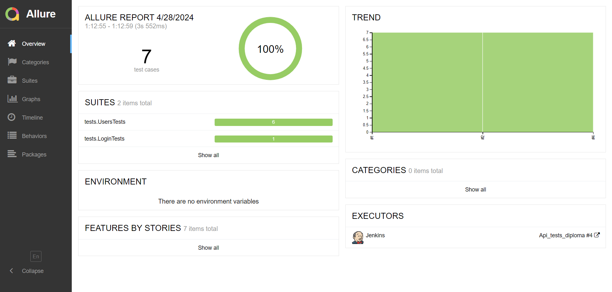
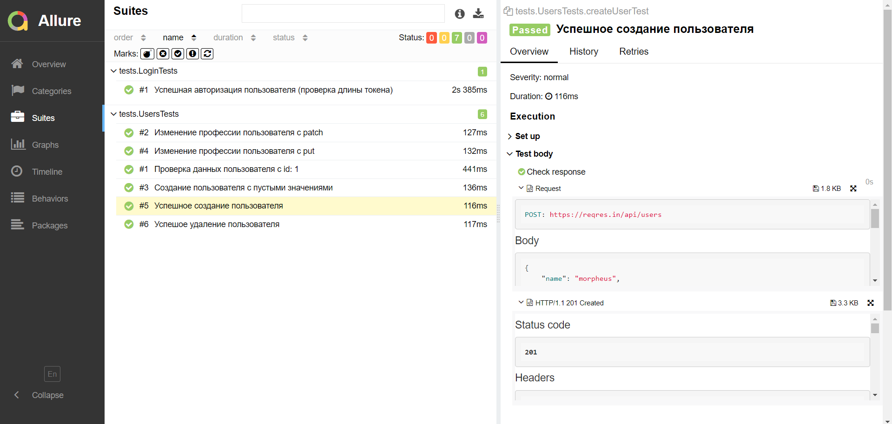
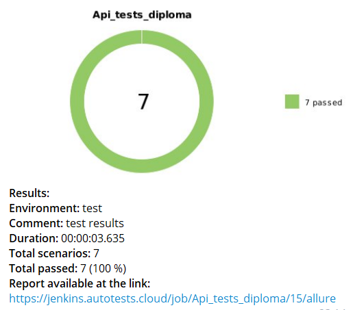

## API-тесты с использованием REST ASSURED для сайта [Reqres.in](https://reqres.in)

## Содержание:
- <a href="#technologies">Технологии и инструменты</a> 
- <a href="#test-cases">Покрытый функционал</a>
- <a href="#RuningTests">Локальный запуск тестов</a>
- <a href="#Jenkins">Удаленный запуск тестов на Jenkins</a>
- <a href="#allure">Allure-отчет</a>
- <a href="#telegram">Уведомления в Telegram</a>
 
 <a id="technologies"></a>
 ## Технологии и инструменты
<a href="https://www.jetbrains.com/idea/"></a> IntelliJ IDEA: Это интегрированная среда разработки (IDE) для Java. Она предлагает множество функций, которые помогают повысить производительность разработчиков, включая умное автодополнение кода, поддержку различных фреймворков, интеграцию с системами контроля версий и многие другие.

<a href="https://www.java.com/"></a> Java: Это высокоуровневый, классно-ориентированный, объектно-ориентированный язык программирования, который предназначен для разработки программного обеспечения для широкого спектра платформ.


<a href="https://github.com/"></a> GitHub: Это веб-сервис для хостинга репозиториев Git, который предлагает все стандартные функции системы управления версиями Git, а также собственные функции, такие как баг-трекинг, управление задачами, функциональность вики для каждого проекта и другое.

<a href="https://gradle.org/"></a> Gradle: Это открытый и современный инструмент сборки, который позволяет разработчикам непринужденно создавать программное обеспечение. Он предлагает гибкие и мощные функции для сборки, включая инкрементную сборку, интеграцию с системами контроля версий и многие другие.

<a href="https://junit.org/junit5/"></a> Junit5: Это фреймворк для модульного тестирования в Java. Он используется для тестирования отдельных единиц функциональности в программе.

<a href="https://rest-assured.io/"></a> RestAssured: Это фреймворк для тестирования REST-сервисов в Java. Он предоставляет удобный интерфейс для отправки HTTP-запросов и получения HTTP-ответов.

<a href="https://www.jenkins.io/"></a> Jenkins: Это открытый сервер автоматизации, который помогает автоматизировать части процесса разработки программного обеспечения, связанные с непрерывной интеграцией и непрерывной доставкой.

<a href="https://github.com/allure-framework/allure2"></a> Allure: Это открытый инструмент для визуализации результатов автоматического тестирования, который предлагает красивые и информативные отчеты.

<a href="https://telegram.org/"></a> Telegram: Это облачный сервис мгновенного обмена сообщениями. В контексте разработки программного обеспечения он часто используется для уведомлений о состоянии сборок, тестов и развертываний.


<a id="test-cases"></a>
## Покрытый функционал
:heavy_check_mark: Авторизация пользователя \
:heavy_check_mark: Cоздание пользователя \
:heavy_check_mark: Создание пользователя с пустыми значениями \
:heavy_check_mark: Изменение профессии пользователя c put \
:heavy_check_mark: Изменение профессии пользователя c patch \
:heavy_check_mark: Проверка данных пользователя с id: 1 \
:heavy_check_mark: Удаление пользователя
  
<a id="RuningTests"></a>
## Локальный запуск тестов
Для локального запуска тестов необходимо открыть терминал, перейти в директорию проекта и выполнить команду:
```
gradle clean test
```

<a id="Jenkins"></a>
## Удаленный запуск тестов на Jenkins
Удаленный запуск тестов реализован через CI/CD инструмент - <code>Jenkins</code>. 
Для запуска используется следующая команда:
```
clean test
```


<p align="center">

</p>
Последний успешный запуск: https://jenkins.autotests.cloud/job/Api_tests_diploma/15/

<a id="allure"></a>
## Allure-отчет 
В данном проекте используется система <code>Allure</code> для визуализации результатов тестирования. 

**Локальный запуск:** после выполнения тестов, <code>Allure-отчет</code> генерируется с помощью команды:
```bash
allure serve build/allure-results
```
В результате будет запущен веб-сервер, и в браузере откроется отчет. 

**Удаленный запуск:** 
после завершения сборки и прогона тестов через <code>Jenkins</code> отчеты будут сформированы автоматически:
<p align="center">

</p>
<p align="center">

</p>
Последний успешный отчет: https://jenkins.autotests.cloud/job/Api_tests_diploma/15/allure/

<a id="telegram"></a>
## Уведомления в Telegram
После завершения сборки специальный бот, созданный в <code>Telegram</code>, автоматически обрабатывает и отправляет сообщение с отчетом.

<p align="center">

</p>


 
