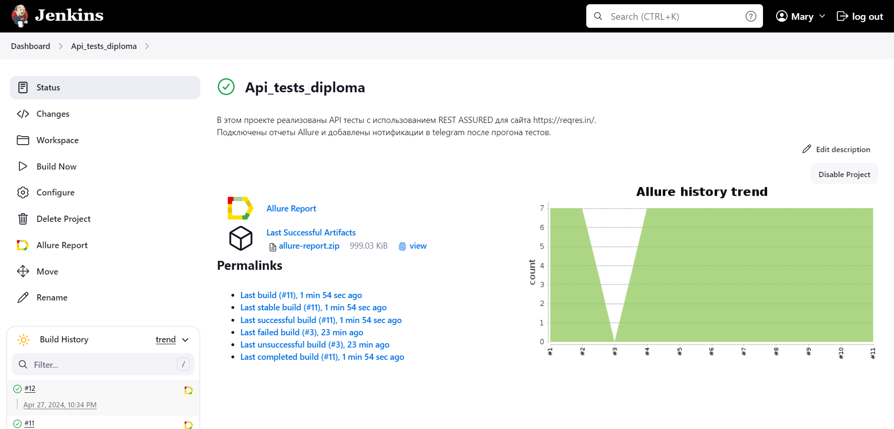

## API-тесты с использованием REST ASSURED для сайта [Regres.in](https://reqres.in)

## Содержание:
- <a href="#technologies">Технологии и инструменты</a> 
- <a href="#test-cases">Покрытый функционал</a>
- <a href="#RuningTests">Локальный запуск тестов</a>
- <a href="#Jenkins">Удаленный запуск тестов на Jenkins</a>
- <a href="#allure">Allure-отчет</a>
- <a href="#telegram">Уведомления в Telegram</a>
 
 <a id="technologies"></a>
 ## Технологии и инструменты

 <p align="left">
<a href="https://www.jetbrains.com/idea/">
<a href="https://www.java.com/">
<a href="https://github.com/">
<a href="https://gradle.org/">
<a href="https://junit.org/junit5/">
<a href="https://rest-assured.io/">
<a href="https://www.jenkins.io/">
<a href="https://github.com/allure-framework/allure2">
<a href="https://telegram.org/">

   
<a id="test-cases"></a>
## Покрытый функционал
:heavy_check_mark: Авторизация пользователя \
:heavy_check_mark: Cоздание пользователя \
:heavy_check_mark: Создание пользователя с пустыми значениями \
:heavy_check_mark: Изменение профессии пользователя c put \
:heavy_check_mark: Изменение профессии пользователя c patch \
:heavy_check_mark: Проверка данных пользователя с id: 1 \
:heavy_check_mark: Удаление пользователя
  
<a id="RuningTests"></a>
## Локальный запуск тестов
Для локального запуска тестов необходимо открыть терминал, перейти в директорию проекта и выполнить команду:
```
gradle clean test
```

<a id="Jenkins"></a>
## Удаленный запуск тестов на Jenkins
В данном проекте предусмотрена возможность удаленного запуска тестов через CI/CD инструмент - <code>Jenkins</code>. 
Для запуска используется следующая команда:
```
clean test
```


<p align="center">

</p>

<a id="allure"></a>
## Allure-отчет 
В данном проекте используется система <code>Allure</code> для визуализации результатов тестирования. 

**Локальный запуск:** после выполнения тестов, <code>Allure-отчет</code> генерируется с помощью команды:
```bash
allure serve build/allure-results
```
В результате будет запущен веб-сервер, и в браузере откроется отчет. 

**Удаленный запуск:** 
после завершения сборки и прогона тестов через <code>Jenkins</code> отчеты будут сформированы автоматически:
<p align="center">

</p>
<p align="center">

</p>

<a id="telegram"></a>
## Уведомления в Telegram
После завершения сборки специальный бот, созданный в <code>Telegram</code>, автоматически обрабатывает и отправляет сообщение с отчетом.

<p align="center">

</p>


 
